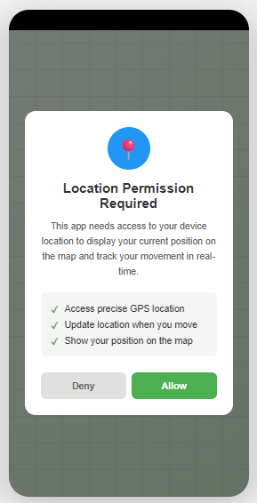
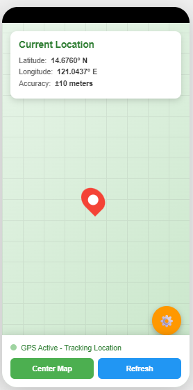
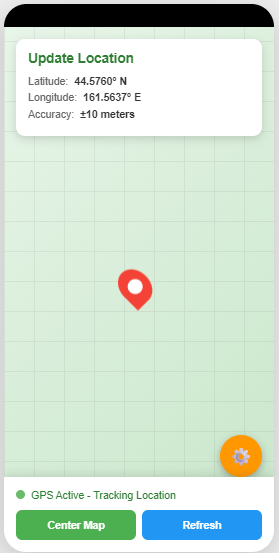

# Location Tracker App

## 📱 App Description

A mobile application that displays the user's live GPS location on a map using the device's location services. The app requests location permission, shows the user's current position with a marker on an interactive map, and updates the location in real-time as the user moves.

## 🔐 Permissions Used

### ACCESS_FINE_LOCATION
- **Purpose:** Obtain precise GPS coordinates from satellite signals
- **Usage:** Provides accurate latitude and longitude for displaying the user's exact position on the map
- **Privacy:** Requires explicit user consent before accessing location data

### ACCESS_COARSE_LOCATION
- **Purpose:** Obtain approximate location using network-based positioning
- **Usage:** Fallback option when GPS is unavailable; uses Wi-Fi and cellular networks for location
- **Privacy:** Less precise than fine location but still requires user permission

## 📍 How GPS Location is Obtained

### GPS Technology
The Global Positioning System (GPS) determines a device's location through satellite communication:

1. **Satellite Signals:** The device receives signals from multiple GPS satellites orbiting Earth
2. **Triangulation:** By measuring the time it takes for signals to arrive from at least 4 satellites, the device calculates its precise position
3. **Location Data:** GPS provides latitude, longitude, altitude, and accuracy measurements

### Android Location Providers

**GPS Provider:**
- High accuracy (5-20 meters)
- Requires clear view of the sky
- Higher battery consumption
- Best for outdoor navigation

**Network Provider:**
- Medium accuracy (100-500 meters)
- Uses Wi-Fi and cellular tower data
- Lower battery consumption
- Works indoors and in urban areas

### Implementation Process

In this app, location data is obtained through the following steps:

1. **Request Permissions:** App asks user for location access when first launched
2. **Initialize Location Services:** Connect to Android's FusedLocationProviderClient (combines GPS and Network data)
3. **Request Updates:** Set update intervals and accuracy requirements
4. **Receive Location:** Get latitude, longitude, and accuracy from the device
5. **Display on Map:** Show location marker and update as coordinates change

## 📸 Screenshots

### 1. Permission Request

The app displays a clear dialog explaining why location access is needed, with options to Allow or Deny.

### 2. Map with Location

Main screen showing the interactive map with a red marker indicating the user's current position. The info card displays precise GPS coordinates and accuracy.

### 3. Location Update

Demonstrates real-time location tracking as the GPS coordinates update when the user moves.

---